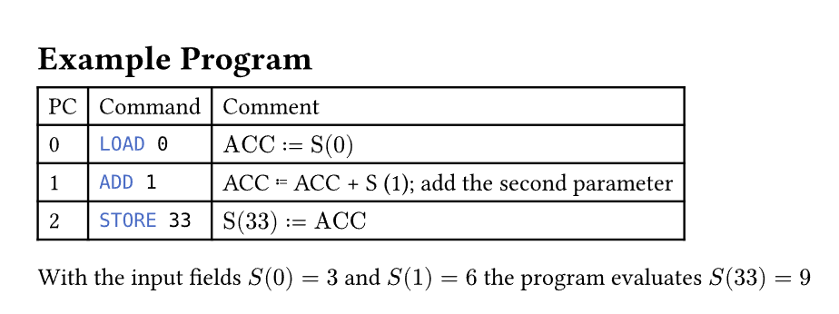

# ReTI.typ

[Typst](https://github.com/typst/typst) utility for the assembly-like language "ReTI" at the University of Freiburg.

## features

-   [x] 🧠 interpreter
-   [x] 📑 code table with automatic math translation/documentation

## installation

### With [typkg](https://github.com/Tch1b0/typkg)

```sh
typkg https://github.com/Tch1b0/ReTI.typ
```

### Manually

Windows (Powershell)

```sh
git clone https://github.com/Tch1b0/ReTI.typ $env:APPDATA/typst/packages/local/reti/1.0.0
```

Linux

```sh
git clone https://github.com/Tch1b0/ReTI.typ $XDG_DATA_HOME/typst/packages/local/reti/1.0.0
```

MacOS

```sh
git clone https://github.com/Tch1b0/ReTI.typ "~/Library/Application Support/typst/packages/local/reti/1.0.0"
```

## usage

`my_document.typ`

```typ
#import "@local/reti:1.0.0": draw_reti_table, interpret_reti

#draw_reti_table("./example_program.reti", start_idx: 1, storage_name "M")

#let storage = (0,) * 100
#let results = interpret_reti("./example_program.reti", storage)

#let resulting_storage = results.at(0)
#let steps = results.at(1)
```

`example_program.reti`

```asm
{ReTI code...} [optional inline documentation prefixed with #]
```

## example

`my_document.typ`

```typ
#import "@local/reti:1.0.0": draw_reti_table, interpret_reti

= Example Program

#draw_reti_table("./example_program.reti", lang: "en")

#let storage = (0,) * 50
#{
  storage.at(0) = 3
  storage.at(1) = 6
}

#let results = interpret_reti("./example_program.reti", storage)
#let resulting_storage = results.at(0)
#let steps = results.at(1)

With the input fields $S(0) = #storage.at(0)$ and $S(1) = #storage.at(1)$ the program evaluates $S(33) = #resulting_storage.at(33)$
```

`example_program.reti`

```asm
LOAD 0
ADD 1 #GEN; add the second parameter
STORE 33
```

`my_document.pdf`


